# 🛒 Olist E-Commerce Data Analysis  

### 📌 Introduction  
This project explores the **Olist Brazilian E-Commerce dataset**, a comprehensive collection of real transaction records from an online marketplace. The dataset captures every step of the order lifecycle — from purchase, payment, and shipping to customer feedback.  

It contains information across multiple dimensions:  
- **Orders** 📝 – purchase timestamps, delivery performance  
- **Products** 📦 – categories, descriptions, attributes  
- **Sellers** 🏬 – marketplace vendor profiles  
- **Customers** 👥 – demographics and locations  
- **Payments & Reviews** 💳⭐ – payment methods, installment patterns, and customer satisfaction  

By analyzing these tables through SQL, we uncover insights into **sales trends, logistics efficiency, customer behavior, and market growth opportunities**.  

---

## 📑 Table of Contents  
- [📈 Order Volume by Year](#-order-volume-by-year)  
- [💳 Sequential Payments](#-sequential-payments)  
- [💵 Sales by Year](#-sales-by-year)  
- [📦 Sales by Product Category](#-sales-by-product-category)  
- [🚚 Delivery Efficiency](#-delivery-efficiency)  
- [⏱️ Average Delivery Time](#️-average-delivery-time)  
- [🏬 Key Suppliers](#-key-suppliers)  
- [🌍 Top Markets](#-top-markets)  
- [⭐ Customer Reviews Metrics](#-customer-reviews-metrics)  

---

## 📈 Order Volume by Year  

```sql
SELECT COUNT(*) AS Total_orders
FROM orders;

SELECT YEAR(order_purchase_timestamp) AS year, COUNT(order_id) AS orders
FROM orders
GROUP BY year
ORDER BY year ASC;
```


## 💳 Sequential Payments  

```sql
WITH recurring_payment_orders AS (
    SELECT order_id
    FROM order_payments
    GROUP BY order_id
    HAVING SUM(payment_sequential) > COUNT(order_id) 
)
SELECT op.order_id, SUM(op.payment_value) AS Total_Payment
FROM order_payments op
JOIN recurring_payment_orders rpo 
    ON op.order_id = rpo.order_id
GROUP BY op.order_id
ORDER BY op.order_id;
```
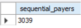

## 💵 Sales by Year  

```sql
SELECT YEAR(ord.order_purchase_timestamp) AS Year, SUM(orp.payment_value) AS Sales
FROM orders ord
LEFT JOIN order_payments orp
    ON ord.order_id = orp.order_id
GROUP BY Year
ORDER BY Year;
```
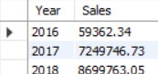

## 📦 Sales by Product Category  

```sql
WITH product_detail AS (
    SELECT ord.order_id, ordi.product_id, prdt.product_category_name_english
    FROM orders ord
    LEFT JOIN order_items ordi
        ON ord.order_id = ordi.order_id
    LEFT JOIN products prd
        ON ordi.product_id = prd.product_id
    LEFT JOIN product_category_name_translation prdt
        ON prd.product_category_name = prdt.product_category_name
), 
payment_detail AS (
    SELECT order_id, SUM(payment_value) AS Payment
    FROM order_payments
    GROUP BY order_id
)
SELECT prod_detail.product_category_name_english AS Product_Category, 
       SUM(pay_detail.payment) AS Sales_Product_Category,
       ROUND((SUM(pay_detail.payment) / (SELECT SUM(payment) FROM payment_detail)) * 100, 1) AS '%_of_sales'
FROM product_detail prod_detail
LEFT JOIN payment_detail pay_detail
    ON prod_detail.order_id = pay_detail.order_id
GROUP BY product_category_name_english
HAVING product_category IS NOT NULL
ORDER BY Sales_Product_Category DESC;
```
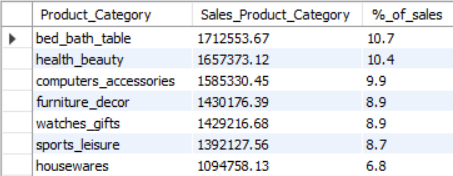

## 🚚 Delivery Efficiency  

```sql
SELECT ROUND(AVG(DATEDIFF(order_delivered_customer_date, order_estimated_delivery_date)), 1) AS Delivery_efficiency
FROM orders;
```
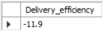

## ⏱️ Average Delivery Time  

```sql
-- Overall delivery time for delivered orders
SELECT ROUND(AVG(DATEDIFF(order_delivered_customer_date, order_purchase_timestamp)), 1) AS Average_Delivery_Time_days
FROM orders
GROUP BY order_status
HAVING order_status = 'delivered';

-- Average delivery time by city
SELECT customer_state, customer_city, ROUND(AVG(delivery_time), 1) AS avg_delivery_time
FROM (
    SELECT ppl.customer_zip_code_prefix, 
           ppl.customer_city, 
           ppl.customer_state, 
           DATEDIFF(order_delivered_customer_date, order_purchase_timestamp) AS delivery_time
    FROM orders ord
    LEFT JOIN customers ppl
        ON ord.customer_id = ppl.customer_id
    WHERE order_status = 'delivered'
) Delivery_by_City
GROUP BY customer_state, customer_city
ORDER BY avg_delivery_time DESC;
```
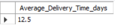
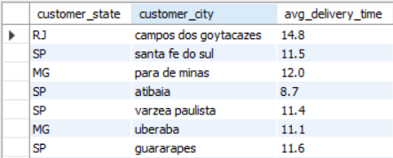

## 🏬 Key Suppliers  

```sql
SELECT s.seller_id,
       ROUND(SUM(op.payment_value), 1) AS total_sales,
       COUNT(DISTINCT o.order_id) AS total_orders
FROM orders o
JOIN order_payments op 
    ON o.order_id = op.order_id
JOIN order_items oi 
    ON o.order_id = oi.order_id
JOIN sellers s 
    ON oi.seller_id = s.seller_id
WHERE o.order_status = 'delivered'
GROUP BY s.seller_id
ORDER BY total_sales DESC
LIMIT 10;
```
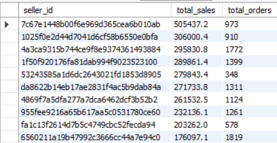

## 🌍 Top Markets  

```sql
SELECT c.customer_state,
       ROUND(SUM(op.payment_value), 2) AS total_sales,
       COUNT(DISTINCT o.order_id) AS total_orders,
       COUNT(DISTINCT c.customer_id) AS unique_customers
FROM orders o
JOIN order_payments op 
    ON o.order_id = op.order_id
JOIN customers c 
    ON o.customer_id = c.customer_id
WHERE o.order_status = 'delivered'
GROUP BY c.customer_state
ORDER BY total_sales DESC;
```
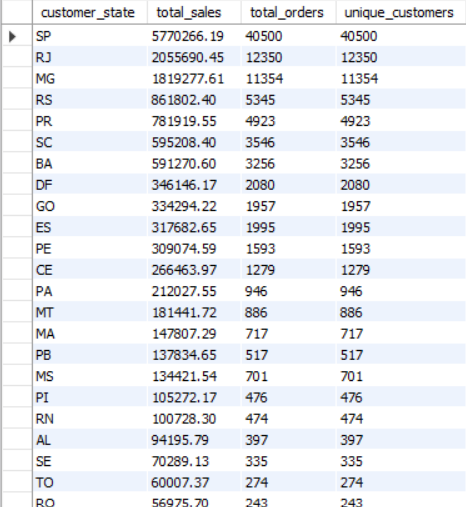

## ⭐ Customer Reviews Metrics  

```sql
-- Review score distribution
SELECT review_score,
       COUNT(*) AS total_reviews,
       ROUND(COUNT(*) * 100.0 / (SELECT COUNT(*) FROM order_reviews), 1) AS percentage
FROM order_reviews
GROUP BY review_score
ORDER BY review_score DESC;

-- Average rating
SELECT ROUND(AVG(review_score), 2) AS avg_review_score
FROM order_reviews;

-- Positive vs Negative reviews
SELECT 
    CASE 
        WHEN review_score >= 4 THEN 'Positive'
        WHEN review_score = 3 THEN 'Neutral'
        ELSE 'Negative'
    END AS review_category,
    COUNT(*) AS total_reviews,
    ROUND(COUNT(*) * 100.0 / (SELECT COUNT(*) FROM order_reviews), 1) AS percentage
FROM order_reviews
GROUP BY review_category
ORDER BY percentage DESC;
```
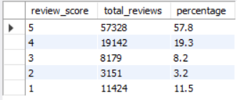
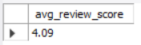
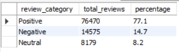

